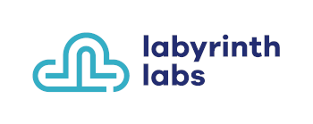

# AWS EKS External Secrets Terraform module

We help companies build, run, deploy and scale software and infrastructure by embracing the right technologies and principles. Check out our website at https://lablabs.io/

---

## Description

A terraform module to deploy an External Secrets Operator on Amazon EKS cluster.

## Related Projects

Check out other [terraform kubernetes addons](https://github.com/lablabs?q=terraform-eks).

## Examples

See [Basic example](examples/basic/README.md) for further information.

## Potential issues with running terraform plan

When deploying with ArgoCD application, Kubernetes terraform provider requires access to Kubernetes cluster API during plan time. This introduces potential issue when you want to deploy the cluster with this addon at the same time, during the same Terraform run.

To overcome this issue, the module deploys the ArgoCD application object using the Helm provider, which does not require API access during plan. If you want to deploy the application using this workaround, you can set the `argo_application_use_helm` variable to `true`.

<!-- BEGINNING OF PRE-COMMIT-TERRAFORM DOCS HOOK -->
## Requirements

| Name | Version |
|------|---------|
|  [terraform](#requirement\_terraform) | >= 0.14 |
|  [aws](#requirement\_aws) | >= 2.0 |
|  [helm](#requirement\_helm) | >= 1.0.0 |
|  [kubernetes](#requirement\_kubernetes) | >= 2.6 |
|  [utils](#requirement\_utils) | >= 0.14.0 |

## Modules

No modules.

## Resources

| Name | Type |
|------|------|
| [helm_release.argocd_application](https://registry.terraform.io/providers/hashicorp/helm/latest/docs/resources/release) | resource |
| [helm_release.this](https://registry.terraform.io/providers/hashicorp/helm/latest/docs/resources/release) | resource |
| [kubernetes_manifest.this](https://registry.terraform.io/providers/hashicorp/kubernetes/latest/docs/resources/manifest) | resource |
| [aws_region.current](https://registry.terraform.io/providers/hashicorp/aws/latest/docs/data-sources/region) | data source |
| [utils_deep_merge_yaml.argo_application_values](https://registry.terraform.io/providers/cloudposse/utils/latest/docs/data-sources/deep_merge_yaml) | data source |
| [utils_deep_merge_yaml.values](https://registry.terraform.io/providers/cloudposse/utils/latest/docs/data-sources/deep_merge_yaml) | data source |

## Inputs

| Name | Description | Type | Default | Required |
|------|-------------|------|---------|:--------:|
|  [argo\_application\_enabled](#input\_argo\_application\_enabled) | If set to true, the module will be deployed as ArgoCD application, otherwise it will be deployed as a Helm release | `bool` | `false` | no |
|  [argo\_application\_use\_helm](#input\_argo\_application\_use\_helm) | If set to true, the ArgoCD Application manifest will be deployed using Kubernetes provider as a Helm release. Otherwise it'll be deployed as a Kubernetes manifest. See Readme for more info | `bool` | `false` | no |
|  [argo\_application\_values](#input\_argo\_application\_values) | Value overrides to use when deploying argo application object with helm | `string` | `""` | no |
|  [argo\_destionation\_server](#input\_argo\_destionation\_server) | Destination server for ArgoCD Application | `string` | `"https://kubernetes.default.svc"` | no |
|  [argo\_info](#input\_argo\_info) | ArgoCD info manifest parameter | `list` | <pre>[   {     "name": "terraform",     "value": "true"   } ]</pre> | no |
|  [argo\_namespace](#input\_argo\_namespace) | Namespace to deploy ArgoCD application CRD to | `string` | `"argo"` | no |
|  [argo\_project](#input\_argo\_project) | ArgoCD Application project | `string` | `"default"` | no |
|  [argo\_sync\_policy](#input\_argo\_sync\_policy) | ArgoCD syncPolicy manifest parameter | `map` | `{}` | no |
|  [enabled](#input\_enabled) | Variable indicating whether deployment is enabled | `bool` | `true` | no |
|  [helm\_chart\_name](#input\_helm\_chart\_name) | Helm chart name to be installed | `string` | `"external-secrets"` | no |
|  [helm\_chart\_version](#input\_helm\_chart\_version) | Version of the Helm chart | `string` | `"0.4.4"` | no |
|  [helm\_create\_namespace](#input\_helm\_create\_namespace) | Whether to create k8s namespace with name defined by `k8s_namespace` | `bool` | `true` | no |
|  [helm\_release\_name](#input\_helm\_release\_name) | Helm release name | `string` | `"external-secrets"` | no |
|  [helm\_repo\_url](#input\_helm\_repo\_url) | Helm repository | `string` | `"https://charts.external-secrets.io"` | no |
|  [k8s\_namespace](#input\_k8s\_namespace) | The K8s namespace in which the external-secrets will be installed | `string` | `"kube-system"` | no |
|  [settings](#input\_settings) | Additional settings which will be passed to the Helm chart values, see https://github.com/external-secrets/external-secrets/tree/main/deploy/charts/external-secrets#values | `map(any)` | `{}` | no |
|  [values](#input\_values) | Additional yaml encoded values which will be passed to the Helm chart, see https://github.com/external-secrets/external-secrets/tree/main/deploy/charts/external-secrets#values | `string` | `""` | no |

## Outputs

| Name | Description |
|------|-------------|
|  [helm\_release\_application\_metadata](#output\_helm\_release\_application\_metadata) | Argo application helm release attributes |
|  [helm\_release\_metadata](#output\_helm\_release\_metadata) | Helm release attributes |
|  [kubernetes\_application\_attributes](#output\_kubernetes\_application\_attributes) | Argo kubernetes manifest attributes |
<!-- END OF PRE-COMMIT-TERRAFORM DOCS HOOK -->

## Contributing and reporting issues

Feel free to create an issue in this repository if you have questions, suggestions or feature requests.

### Validation, linters and pull-requests

We want to provide high quality code and modules. For this reason we are using
several [pre-commit hooks](.pre-commit-config.yaml) and
[GitHub Actions workflow](.github/workflows/main.yml). A pull-request to the
master branch will trigger these validations and lints automatically. Please
check your code before you will create pull-requests. See
[pre-commit documentation](https://pre-commit.com/) and
[GitHub Actions documentation](https://docs.github.com/en/actions) for further
details.

## License

See [LICENSE](LICENSE) for full details.

    Licensed to the Apache Software Foundation (ASF) under one
    or more contributor license agreements.  See the NOTICE file
    distributed with this work for additional information
    regarding copyright ownership.  The ASF licenses this file
    to you under the Apache License, Version 2.0 (the
    "License"); you may not use this file except in compliance
    with the License.  You may obtain a copy of the License at

      https://www.apache.org/licenses/LICENSE-2.0

    Unless required by applicable law or agreed to in writing,
    software distributed under the License is distributed on an
    "AS IS" BASIS, WITHOUT WARRANTIES OR CONDITIONS OF ANY
    KIND, either express or implied.  See the License for the
    specific language governing permissions and limitations
    under the License.
